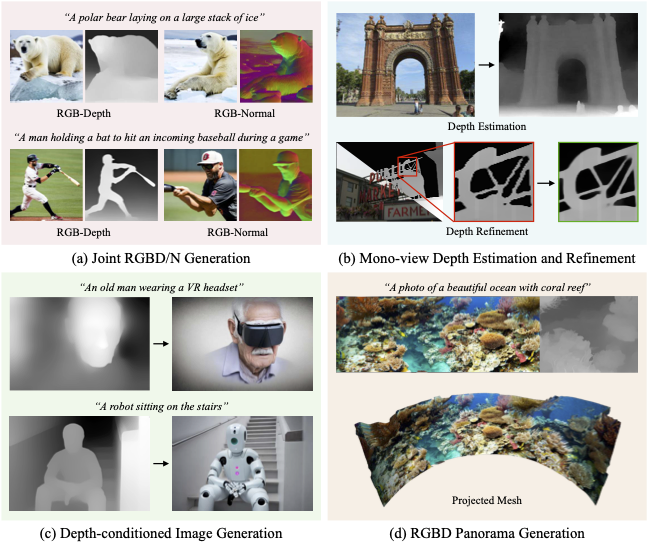

# JointNet: Extending Text-to-Image Diffusion for Dense Distribution Modeling
Jingyang Zhang<sup>1</sup>, Shiwei Li<sup>1</sup>, Yuanxun Lu<sup>3</sup>, Tian Fang<sup>1</sup>, David McKinnon<sup>1</sup>, Yanghai Tsin<sup>1</sup>, Long Quan<sup>2</sup>, Yao Yao<sup>3*</sup>  
<sup>1</sup>Apple, <sup>2</sup>HKUST, <sup>3</sup>Nanjing University
### [Project Page](https://jzhangbs.github.io/jointnet_proj_page/) | [Paper](https://arxiv.org/abs/2310.06347) | [Weights](#about-pretrained-models)
This is the official implementation of JointNet, a novel neural network architecture for modeling the joint distribution of images and an additional dense modality (e.g., depth maps). It is extended from a pre-trained text-to-image diffusion model, so as to enable efficient learning of the new modality while maintaining the strong generalization. JointNet can perform a variety of applications, including joint RGBD generation, dense depth prediction, depth-conditioned image generation, and tile-based 3D panorama generation.

<p align="center">
  
</p>

## Usage
### Setup
Install dependencies:
``` bash
pip install torch==2.0.1 torchvision==0.15.2 torchaudio==2.0.2
pip install -r requirements.txt
```
Note that the version requirement of `diffusers` is strict. Specifically the class `jointnet.py:JointNetModel` inherits `UNet2DConditionModel`. If `diffusers` have to be updated, the interface of `JointNetModel` should be updated as well.

### About Pretrained Models
We provide two models. `rgbd_finetune_sd21b` [link](https://docs-assets.developer.apple.com/ml-research/models/iclr24-jointnet/rgbd_finetune_sd21b.zip) is the default joint generation model, and `rgbd_inpaint_sd21b` [link](https://docs-assets.developer.apple.com/ml-research/models/iclr24-jointnet/rgbd_inpaint_sd21b.zip) is for inpainting tasks, which is finetuned to condition on masked input images. 

### Joint Generation
`jointnet_pipeline.py` provides the pipeline for joint generation. Directly launch it to have a quick test:
``` bash
python jointnet_pipeline.py \
  --model path/to/model \
  --prompt "A cat sitting on a wooden bench outside" \
  --modalities depth \
  --out_prefix examples/test_gen
```
Please refer to the script for more available arguments.

### Inpainting
Use `jointnet_inpaint_pipeline.py` for inpainting tasks. Different masks can be applied to RGB and the joint modality. A example of general usage:
``` bash
python jointnet_inpaint_pipeline.py \
  --model path/to/model \
  --prompt "A dog sitting on a wooden bench outside" \
  --modalities depth \
  --image examples/inpaint_image.png \
  --mask examples/inpaint_image_mask.png \
  --joint_input examples/inpaint_depth.png \
  --joint_mask examples/inpaint_depth_mask.png \
  --denoising_strength 0.9 \
  --out_prefix examples/test_inpaint
```
As mentioned in the paper, we can do bidirectional conversion between RGB and the joint modality by channel-wise inpainting. We provide presets for these tasks:
``` bash
# Image to depth
python jointnet_inpaint_pipeline.py \
  --model path/to/model \
  --prompt "A cat sitting on a wooden bench outside" \
  --modalities depth \
  --image examples/inpaint_image.png \
  --preset rgb2j \
  --denoising_strength 1.0 \
  --out_prefix examples/test_rgb2d
# Depth to image
python jointnet_inpaint_pipeline.py \
  --model path/to/model \
  --prompt "A cat sitting on a wooden bench outside" \
  --modalities depth \
  --joint_input examples/inpaint_depth.png \
  --preset j2rgb \
  --denoising_strength 1.0 \
  --out_prefix examples/test_d2rgb
```

### Tile-based Diffusion
`jointnetpano_pipeline.py` and `jointnetpano_inpaint_pipeline.py` provides tile-based diffusion pipelines for panoramas. The interface is similar to the non-tile-based ones. 

`jointnet_upsample_pipeline.py` is a tile-based pipeline for general purpose upsampling. The interface is similar to the inpaint pipeline. You can also choose to only upsample either image or the joint modality. In this case the upsampling is conditioned on the other side in the target resolution. This can be set by `--preset both/image/joint`

## License
This sample code is released under the [LICENSE](LICENSE) terms.

## Citation
```
@article{zhang2024jointnet,
  title={JointNet: Extending Text-to-Image Diffusion for Dense Distribution Modeling},
  author={Zhang, Jingyang and Li, Shiwei and Lu, Yuanxun and Fang, Tian and McKinnon, David and Tsin, Yanghai and Quan, Long and Yao, Yao},
  journal={International Conference on Learning Representations (ICLR)},
  year={2024}
}
```
